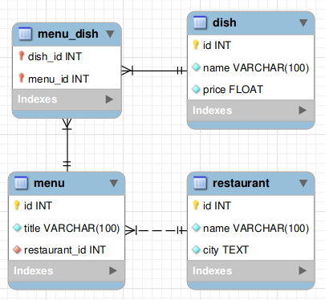

# SQL Queries

Import the [restaurant.sql](./restaurant.sql) file into MySQL.

Create the following queries :

1. Select all restaurant's name

2. Select all menu's title alphabetically

3. Select each dish's name and price, in decreasing price order

4. Select restaurant's name located in the city of Paris

5. Select all menu's title which contains the word "menu"

6. Select cities without duplicates

7. Select the name of the most expensive dish

8. Select all menu's title and the restaurant's name where they are sold

9. Select all dish's name (without duplicate) which are contained by at least one menu

10. Select all dish's name and price with corresponding menu's title

11. Select each dish's name and price, corresponding menu's title and restaurant's name who sells it

12. Select all the restaurants' name which don't sell any menu

13. Select all dish's name not contained in any menu

14. Select each city's name and how many restaurants located in this city

15. Select menu's title and dishes' count for each menu

16. Select the title of the menu with the most dishes

17. Select, for each restaurant, its name and how many menus it sells (some restaurants might not have any menu)

18. Select all menu's title and dishes count, where menus have more than two dishes.

19. Select all restaurant's name which sells at least one menu where dishes' price combined is 30 or more

## Hints :

    
Request 1

    SELECT, FROM

    
Request 2

    ORDER BY

    
Request 3

    ORDER BY

    
Request 4

    WHERE

    
Request 5

    LIKE

    
Request 6

    DISTINCT

    
Request 7

    ORDER BY, LIMIT

    
Request 8

    INNER JOIN

    
Request 9

    DISTINCT, INNER JOIN

    
Request 10

    INNER JOIN (x2)

    
Request 11

    INNER JOIN (x3)

    
Request 12

    LEFT JOIN

    
Request 13

    LEFT JOIN

    
Request 14

    COUNT, GROUP BY

    
Request 15

    COUNT, INNER JOIN (x2), GROUP BY

    
Request 16

    CCOUNT, INNER JOIN (x2), GROUP BY, ORDER BY, LIMIT

    
Request 17

    COUNT, LEFT JOIN, GROUP BY

    
Request 18

    COUNT, INNER JOIN, GROUP BY, HAVING

    
Request 19

    DISTINCT, INNER JOIN (x3), GROUP BY, HAVING

